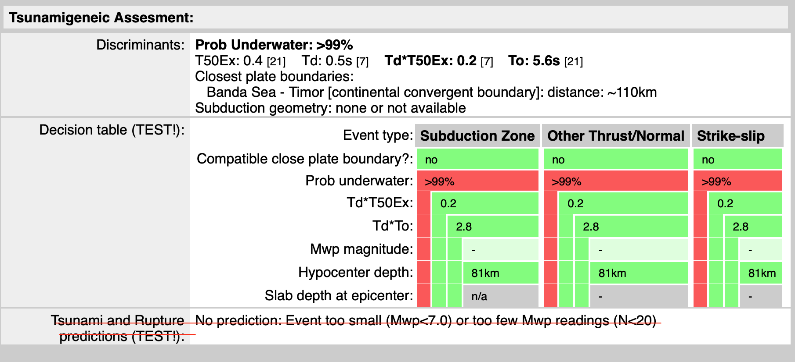

<!-- START doctoc generated TOC please keep comment here to allow auto update -->
<!-- DON'T EDIT THIS SECTION, INSTEAD RE-RUN doctoc TO UPDATE -->
**Table of Contents**  *generated with [DocToc](https://github.com/thlorenz/doctoc)*

- [tsunamigenic evaluator](#tsunamigenic-evaluator)
  - [Introduction](#introduction)
  - [Quickstart](#quickstart)
    - [Get Docker image](#get-docker-image)
      - [1) Get built image from DockerHub (*preferred*)](#1-get-built-image-from-dockerhub-preferred)
      - [2) Build by yourself](#2-build-by-yourself)
    - [Run as a service](#run-as-a-service)
  - [Input/Output format](#inputoutput-format)
    - [Input](#input)
    - [output](#output)
    - [Example using `curl`:](#example-using-curl)
  - [Test the evaluator as a stand alone script](#test-the-evaluator-as-a-stand-alone-script)
  - [Contribute](#contribute)
  - [Authors](#authors)

<!-- END doctoc generated TOC please keep comment here to allow auto update -->

[](https://github.com/INGV/tsunamigenic-evaluator/blob/main/LICENSE)
[](https://github.com/INGV/tsunamigenic-evaluator/issues)

[](https://hub.docker.com/r/ingv/tsunamigenic-evaluator)


[](https://github.com/INGV/tsunamigenic-evaluator/actions)
[](https://github.com/INGV/tsunamigenic-evaluator)


# tsunamigenic evaluator

## Introduction
This project implement the web services for evaluating the tsunamigenic potentiality of an event, based on the rules defined by early-Est 1.1.9. Its output provide an ad-hoc json-formatted data.

Its result can be Graphically formatted in the following  table  



## Quickstart
### Get Docker image
To obtain *tsunamigenic-evaluator* docker image, you have two options:

#### 1) Get built image from DockerHub (*preferred*)
Get the last built image from DockerHub repository:
```sh
docker pull ingv/tsunamigenic-evaluator:latest
```

#### 2) Build by yourself
Clone the git repositry:
```sh
git clone https://github.com/INGV/tsunamigenic-evaluator.git
cd tsunamigenic-evaluator
```
build the image:
```sh
docker build --tag ingv/tsunamigenic-evaluator . 
```

in case of errors, try:
```sh
docker build --no-cache --pull --tag ingv/tsunamigenic-evaluator . 
```

### Run as a service
run the container in daemon (`-d`) mode:

```sh
docker run -it --name flask-tsunamigenic-evaluator -p 8383:5000 -d --user $(id -u):$(id -g) --rm ingv/tsunamigenic-evaluator
```

to show the log:

```
docker exec -i flask-tsunamigenic-evaluator tail -f /opt/log/tsunamigenic-evaluator.log
```

Then test access to: http://localhost:8383/

## Input/Output format
### Input
The input is a json file with the event parameters like the following example. All the keys are present in the `monitor.xml` file of Early-est

```json
{
    "event_id": "123455",
    "origin_id": "12345678",
    "lat": 37.19,
    "lon": 14.77,
    "depth": 10,
    "minHorUnc": 7,
    "maxHorUnc": 8,
    "azMaxHorUnc": 156,
    "mag": "None",
    "nr_mag": 0,
    "T50Ex": 0.5,
    "T50Ex_nr": 9,
    "Td": "None",
    "Td_nr": 0,
    "T0": 7.1,
    "T0_nr": 9
}
```

### output
The table has two sections, plus one present only in `Early-Est 1.2.7`. Currently the third section is not yet implemented. 
The two sections are:

* `Discriminants`
* `Decision_table`

The "nested dictionaries" that contain information to build the table, have the same names as the table sections. \
As regards the second section (and the third, when it will be done) we specify that the procedure is a test phase. \
As regards the second section, each element on the vertical axis correspond to a dictionary key to which is referenced one three-valued string that are the valus of x axis. 

```json
{
    "origin_id": "12345678",
    "event_id": "123455",
    "latitude": 37.19,
    "longitude": 14.77,
    "depth": 10,
    "Discriminants": {
        "T50Ex": 0.5,
        "T50Ex_nr": 9,
        "TdT50Ex": "None",
        "TdT50Ex_nr": 0,
        "Td": "None",
        "Td_nr": 0,
        "T0": 7.1,
        "T0_nr": 9,
        "Subduction_geometry": {
            "zone": "none or not available",
            "Slab_depth_at_epicenter": "n/a"
        },
        "Closest_plate_boundaries": [
            [
                60.0,
                "EU-AF",
                "continental transform fault",
                "CTF"
            ],
            [
                60.0,
                "EU/AF",
                "subduction zone",
                "SUB"
            ],
            [
                180.0,
                "EU\\AF",
                "subduction zone",
                "SUB"
            ],
            [
                490.0,
                "AS-EU",
                "continental convergent boundary",
                "CCB"
            ],
            [
                490.0,
                "AS/AF",
                "subduction zone",
                "SUB"
            ],
            [
                980.0,
                "AS-AT",
                "continental transform fault",
                "CTF"
            ],
            [
                980.0,
                "AT-EU",
                "continental transform fault",
                "CTF"
            ]
        ]
    },
    "Decision_table": {
        "event_type": [
            "Subduction Zone",
            "Other Thrust/Normal",
            "Strike-slip"
        ],
        "Compatible_close_plate_boundary_text": [
            "YES (60km)",
            "No",
            "YES (60km)"
        ],
        "Compatible_close_plate_boundary_color": [
            "RED",
            "GREEN",
            "YELLOW"
        ],
        "prob_underwater_text": [
            "<1%"
        ],
        "prob_underwater_color": [
            "GREEN"
        ],
        "TdT50Ex_color": [
            "LTGREEN"
        ],
        "TdT50Ex_value": [
            "-"
        ],
        "tdt0_value": [
            "-"
        ],
        "tdt0_color": [
            "GREY"
        ],
        "Mwp_magnitude_text": [
            "-"
        ],
        "Mwp_magnitude_color": [
            "LTGREEN"
        ],
        "Hypocenter_depth_text": "10 [km]",
        "Hypocenter_depth_color": [
            "RED"
        ],
        "slab_depth_text": [
            "n/a"
        ],
        "slab_depth_color": [
            "GREY"
        ]
    }
}
```

### Example using `curl`:
```sh
curl -X POST http://localhost:8383/api/evaluate \
-H 'Content-Type: application/json' \
-d "{\"event_id\":\"123455\",\"origin_id\":\"12345678\",\"lat\":37.19,\"lon\":14.77,\"depth\":10,\"minHorUnc\":7,\"maxHorUnc\":8,\"azMaxHorUnc\":156,\"mag\":\"None\",\"nr_mag\":0,\"T50Ex\":0.5,\"T50Ex_nr\":9,\"Td\":\"None\",\"Td_nr\":0,\"T0\":7.1,\"T0_nr\":9}" | json_pp
```

## Test the evaluator as a stand alone script

If you have cloned the project, you can check the evaluator engine from command line. \
To do this you need *python3.x* installed on your machine and also some python libraries:
```sh
pip install -r requirements.txt
python main/api/queries.py --help
```

Here is some examples of launch:
```sh
python main/api/queries.py 
python main/api/queries.py -f <input-file.json>
python main/api/queries.py -d "{\"event_id\":\"123455\",\"origin_id\":\"12345678\",\"lat\":37.19,\"lon\":14.77,\"depth\":10,\"minHorUnc\":7,\"maxHorUnc\":8,\"azMaxHorUnc\":156,\"mag\":\"None\",\"nr_mag\":0,\"T50Ex\":0.5,\"T50Ex_nr\":9,\"Td\":\"None\",\"Td_nr\":0,\"T0\":7.1,\"T0_nr\":9}"
```

## Contribute
Thanks to your contributions!

Here is a list of users who already contributed to this repository: \
<a href="https://github.com/ingv/tsunamigenic-evaluator/graphs/contributors">
  
</a>

## Authors
(c) 2023 Sergio Bruni sergio.bruni[at]ingv.it \
(c) 2023 Fabrizio Bernardi fabrizio.bernardi[at]ingv.it \
(c) 2023 Valentino Lauciani valentino.lauciani[at]ingv.it

Istituto Nazionale di Geofisica e Vulcanologia, Italia
