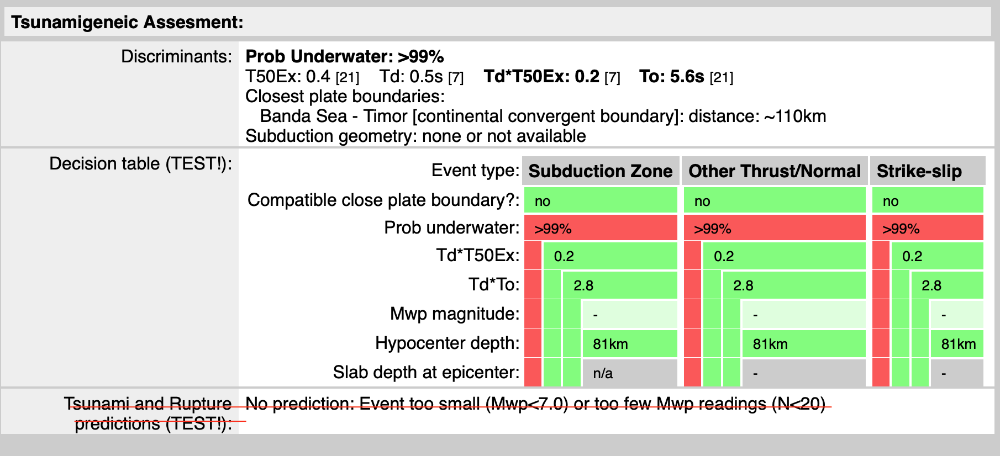

# tsunamigenic evaluator

Questo script determina il potenziale tsunamigenico di un evento secondo le regole definite da early-Est 1.1.9

Graficamente il risultato è mostrato in una tabella descrittiva fatta per ogni evento in `Earquake List --> event_id`

Lo script produce unfile `json` con i campi necessari a riprodurre la tabella descritta nella figura nella cartella `figures` di questo progetto:



## input

L'input file è un `json` con i parametri dell'evento come da esempio qui sotto. Tutte le chiavi e i valori sono presenti nel `monitor.xml`


```
{"event_id"   : "123455",
	"origin_id"   : "12345678",
	"lat"         : 37.19,
	"lon"         : 14.77,
	"depth"       : 10,
	"minHorUnc"   : 7,
	"maxHorUnc"   : 8,
	"azMaxHorUnc" : 156,
	"mag"         : "None",
	"nr_mag"      : 0,
	"T50Ex"       : 0.5,
	"T50Ex_nr"    : 9,
	"Td"          : "None",
	"Td_nr"       : 0,
	"T0"          : 7.1,
	"T0_nr"       : 9}
```

## output

La tabella ha due sezioni più una presente solo dalla versione di `Early-Est 1.2.7`. Attualmente la terza sezione non è implementata in questa versione.

Le due sezioni sono:

* `Discriminants`
* `Decision_table`

I "nested dictionaries" che contengono le informazioni per la costruzione della tabella hanno lo stesso nome delle sezioni.

Per quanto riguarda la seconda sezione (e la terza quando sarà inclusa), occorre indicare che si tratta di procedure in test. Vedi immagine allegata.

Per quanto riguarda la tabella della seconda sezione, ogni elemento sull'asse verticale è una chiave del dizionario, a cui fa seguito una stringa di tre valori che sono i campi dell'asse orizzontale.

```
{
    "origin_id": "12345678",
    "event_id": "123455",
    "latitude": 37.19,
    "longitude": 14.77,
    "depth": 10,
    "Discriminants": {
        "T50Ex": 0.5,
        "T50Ex_nr": 9,
        "TdT50Ex": "None",
        "TdT50Ex_nr": 0,
        "Td": "None",
        "Td_nr": 0,
        "T0": 7.1,
        "T0_nr": 9,
        "Subduction_geometry": {
            "zone": "none or not available",
            "Slab_depth_at_epicenter": "n/a"
        },
        "Closest_plate_boundaries": [
            [
                60.0,
                "EU-AF",
                "continental transform fault",
                "CTF"
            ],
            [
                60.0,
                "EU/AF",
                "subduction zone",
                "SUB"
            ],
            [
                180.0,
                "EU\\AF",
                "subduction zone",
                "SUB"
            ],
            [
                490.0,
                "AS-EU",
                "continental convergent boundary",
                "CCB"
            ],
            [
                490.0,
                "AS/AF",
                "subduction zone",
                "SUB"
            ],
            [
                980.0,
                "AS-AT",
                "continental transform fault",
                "CTF"
            ],
            [
                980.0,
                "AT-EU",
                "continental transform fault",
                "CTF"
            ]
        ]
    },
    "Decision_table": {
        "event_type": [
            "Subduction Zone",
            "Other Thrust/Normal",
            "Strike-slip"
        ],
        "Compatible_close_plate_boundary_text": [
            "YES (60km)",
            "No",
            "YES (60km)"
        ],
        "Compatible_close_plate_boundary_color": [
            "RED",
            "GREEN",
            "YELLOW"
        ],
        "prob_underwater_text": [
            "<1%"
        ],
        "prob_underwater_color": [
            "GREEN"
        ],
        "TdT50Ex_color": [
            "LTGREEN"
        ],
        "TdT50Ex_value": [
            "-"
        ],
        "tdt0_value": [
            "-"
        ],
        "tdt0_color": [
            "GREY"
        ],
        "Mwp_magnitude_text": [
            "-"
        ],
        "Mwp_magnitude_color": [
            "LTGREEN"
        ],
        "Hypocenter_depth_text": "10 [km]",
        "Hypocenter_depth_color": [
            "RED"
        ],
        "slab_depth_text": [
            "n/a"
        ],
        "slab_depth_color": [
            "GREY"
        ]
    }
}
```
